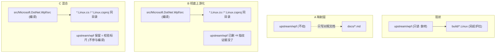

# 上游化（布局对齐）与文档梳理 —— 方案提案

> **状态：提案 · 未实施。** 本文只回答"差异是什么、怎么向上游靠、win/linux 源码怎么共存、文档怎么梳理"，
> 并给出分阶段施工与验收。**动手前请确认路线（见 §9 待裁决）。**
> 所有对照事实都来自本仓现场实测（坐标与件数已逐条核对），可复算命令随各节给出。

---

## §0 一页结论

1. **差异的本质不是"少了什么文件"，而是"同一棵上游源码在仓里出现了两个位置"**：
   本仓把 `dotnet/wpf` 的整棵树 vendored 成 `upstream/wpf/**`（**只读、构建输入**），
   而 fork 根目录**曾**有一份同源的 WPF 树（`src/Microsoft.DotNet.Wpf/**` 等 19 条路径），
   已在 `7027be06e`（P0 结构性去重，2026-09-26）**移除**。
   ⇒ 现在本仓的根布局"像上游、但不是上游"：上游的 `src/Microsoft.DotNet.Wpf/src/<工程>/` 被换成了
   `upstream/wpf/src/Microsoft.DotNet.Wpf/src/<工程>/`（只读快照）＋ `build/<工程>.Linux/`（生成的构建工程）。

2. **"向上游靠 + win/linux 共存"已定做法 = A ＋ C**（§2）：
   - **A · 映射层**：写"上游路径 ↔ 本仓 ↔ Linux 覆盖"的对照表与入门文档（不动构建）；
   - **C · 布局上游化**：Windows 源搬回 `src/Microsoft.DotNet.Wpf/**`，Linux 面**旁挂** `src/Microsoft.DotNet.Wpf.Linux/**`；
   - **B · 彻底上游化**（去掉 vendored、Linux 件同目录并存）**不做**——它会把"Windows 树 = 上游"这条判据弄脏。
   评审口径（**2026-10-04 二次评审修正**）：**Linux 侧的东西一律收在 `src/` 下、名字带 `Linux`**，不另立与 `src/` 平级的根：
   源码 `src/Microsoft.DotNet.Wpf`（win）／`src/Microsoft.DotNet.Wpf.Linux`（linux 覆盖）／`src/Linux/`（Linux 侧仓内设施）；
   文档 `docs/`（原始）／`docs.Linux/`（移植）；一键脚本 `Guide.Linux/`（win 根脚本归 `Guide/`）。
   **根目录不新增目录**（除已定的 `docs.Linux`、`Guide.Linux`）；**路径不要过多重复**。
   ⚠️ 本文早先自造的"`X` / `X.Linux` 成对根"规矩（含 `src.Linux/`）**作废** —— 那是把评审的"src 下"读成了"与 src 平级"。

3. **红线（`7027be06e` 的教训）**：把 `src/Microsoft.DotNet.Wpf/**` 原样拷回 fork 根会**当场打红门禁** ——
   根 `Directory.Build.props` 被 MSBuild 自动导入（求值即 `MSB4236`），且其 **92 个 csproj** 会进
   `build-hygiene-import-check.sh` 候选集 ⇒ `verify-all.sh` 第 `[9]` 步 `cand 88→180 / undeclared 0→92 / reason=drift`。
   ⇒ **"拷回"必须连同"切断自动导入 + 重登记"一起设计**，不能裸拷。

4. **文档梳理**（§4）：把文档分成**成对两根** —— `docs/`（原始/Windows 侧）＋ `docs.Linux/`（移植/Linux 侧），各自内部再分子目录；
   根 `README.md` 改 ason 式门面，导航 `README.ORG.md`（上游原文）与 `docs.Linux/**`。
   ⚠️ **红线**：`docs/` 里 40+ 件 `WAVE*`、`handoff.md`、`ROUTES.md` 是**被冻结机器读取**的证据件（`docs/INDEX.md §4` 明令"不做大搬家"），
   ⇒ 归位/移动**必须同趟改读取端、作整波做**；**不建议删除**。详见 §4.3 与 §6.8。
5. **执行方式**（§5）：**阶段 0（共同依赖）只能一个执行体做，禁并行**；**阶段 1、2、… 每阶段派一个 subagent**。

---

## §1 结构差异（实测）

### 1.1 上游 `dotnet/wpf` 的骨架

```
wpf/                                   ← 上游仓库根
├── Microsoft.Dotnet.Wpf.sln
├── Directory.Build.props / .targets
├── global.json                        ← Arcade SDK pin
├── eng/                               ← Arcade 构建基础设施
├── Documentation/  packaging/  .github/  .azuredevops/
├── src/Microsoft.DotNet.Wpf/
│   ├── Directory.Build.props
│   └── src/                           ← ★ 21 个工程子树（PC/PF/WB/System.Xaml/Shared/Themes/WpfGfx/PBT…）
└── README.md  LICENSE.TXT  SECURITY.md …
```

要点：**"源码 = 构建输入 = 仓库根的 `src/Microsoft.DotNet.Wpf/src/**`"**，唯一一份；构建由 `eng/`（Arcade）驱动。

### 1.2 本仓（`feat-Linux`，HEAD）的骨架

```
WPFOnLinux/                            ← fork（origin=gitee the50w/WPFOnLinux；upstream=dotnet/wpf）
├── upstream/wpf/                      ← ★ 只读 vendored 快照（6417 件 / 116,107,857 B，基点 1cfc37f7 #11837，已裁剪）
│   └── src/Microsoft.DotNet.Wpf/src/<工程>/     ← 所有 Windows 源（构建读这里）
├── src/                               ← ★ 只剩移植的"新增件"
│   ├── WpfGfx.Linux/                  ← 托管侧移植码（*.Linux.cs）
│   └── WpfGfx.Linux.Native/           ← 原生 shim（C）＋ 应用器 tools/patch-*.py
├── build/                             ← Linux 构建基础设施（自建，非 Arcade）
│   ├── port-lib.py / integration-wave.sh / close-wave.sh / SelfBuiltConfig.props
│   ├── <工程>.Linux/*.csproj          ← ★ 由 port-lib.py **整体重写**；手工改会被抹掉
│   └── MilBridge/  third-party/  shims/  DirectWrite.Linux/
├── samples/  tests/  tools/
├── docs/                              ← 54 件（规范/现状/证据链/历史）
├── verify-all.sh   wpf-linux.sln      ← 64 步门禁（DECL 64 gen=#82）
└── README.md / README-Window.md / handoff.md / .github/ **治理面**
```

### 1.3 逐项差异表

| # | 维度 | 上游 | 本仓 | 性质 |
|---|---|---|---|---|
| 1 | Windows 源位置 | `src/Microsoft.DotNet.Wpf/src/**`（唯一） | `upstream/wpf/src/Microsoft.DotNet.Wpf/src/**`（vendored 只读） | **位置迁移**（同一份内容换了个地方） |
| 2 | 源与构建的关系 | 同目录，直接编译 | 跨目录：`build/port-lib.py` 从 vendored 读源，**生成** `build/<工程>.Linux/*.csproj` | **改写了构建模型**（生成式） |
| 3 | 构建基础设施 | `eng/`（Arcade + WpfArcadeSdk） | 自建 `build/*.sh|py` + `Directory.Upstream.props` 切断继承 | **换了一套**（Linux 可跑） |
| 4 | Linux 覆盖层 | 无 | `src/WpfGfx.Linux/**`（`*.Linux.cs`）+ `build/shims/**` + `src/WpfGfx.Linux.Native/**` | **新增面**（这正是要共存的另一半） |
| 5 | 原生渲染 | `WpfGfx`（Windows/VC++） | `wpfgfx_cor3.so`（AOT milcore）+ `libwpfwin32.so` + `libwpfwic.so` | **替换实现** |
| 6 | 测试 | `src/Microsoft.DotNet.Wpf/tests/**`（快照里已裁） | 自建 `tests/**`（parity 216 MB + 各 runner） | **另起** |
| 7 | 文档 | `Documentation/`（入门向） | `docs/`（证据链向） | **取向不同**（见 §4） |
| 8 | 门禁/CI | `eng/` + azure-pipelines | `verify-all.sh` 64 步 + `build/MilBridge/tools/*.sh` 牙 | **自建** |
| 9 | 重复面 | — | **曾**有 fork 根 `src/Microsoft.DotNet.Wpf/**` 与 vendored 重叠，已由 `7027be06e` 移除 | 见 §1.4 |

### 1.4 差异的来历（时间线，可复算）

```bash
cd ~/netTest/GitProj/WPFOnLinux
git log -1 --format='%H %ad %s' --date=short a9141483edec   # fork 与上游的共同祖先
git show --stat a394a4792 | tail -1                          # 整树搬入（引入 vendored + 构建体系）
git show --stat 7027be06e | tail -1                          # 结构性去重
```

| 提交 | 日期 | 做了什么 | 读数 |
|---|---|---|---|
| `a9141483` | 2026-09-19 | fork 与 `upstream/main` 的共同祖先（基点） | HEAD 领先 552 提交 |
| `a394a4792` | — | **整树搬入**：新增 `upstream/wpf/**`（vendored）＋ `build/`＋`samples/`＋`docs/`＋`verify-all.sh`；**同时保留** fork 根的 `src/Microsoft.DotNet.Wpf/**` | 该 commit 下 `src/Microsoft.DotNet.Wpf` = **6821 件 / 123,481,513 B**；`upstream/wpf` = 6415 件 |
| `7027be06e` | 2026-09-26 | **P0 结构性去重**：移除 fork 根与上游重复的 19 条路径 | **7346 件 / 125,377,211 B**：含 `src/Microsoft.DotNet.Wpf`(6821)、`eng/`(272)、`packaging/`(214)、`Documentation/`(24)、`Microsoft.Dotnet.Wpf.sln`、`Restore.cmd`、`build.cmd` 等 |

> ⚠️ **去重不是"洁癖"，是被门禁逼的**：见 §0.3。**"把 win 源码拷回来"若不做配套，就是回退这一步。**
> 现读 `docs/ROUTES.md §8 R8` 仍写着"**去重/上游化这一半按主控裁定暂缓**"（保持现状，只在 README/INDEX 写清
> "构建只读 `upstream/wpf/**`"）—— 本文即是对该路线的一次具体化。

---

## §2 目标形态：向上游靠 + win/linux 共存

### 2.1 三个方案

| 方案 | 一句话 | 改什么 | 好处 | 代价/风险 |
|---|---|---|---|---|
| **A · 映射层** | vendored 快照不动，补一份"上游路径 ↔ `build/*.Linux` 工程 ↔ `src/WpfGfx.Linux` 覆盖"的对照表与入门文档 | 只加文档/索引 | 零门禁风险；新人可读；上游读者能对上号 | 物理布局仍非上游；"共存"是**逻辑上的** |
| **B · 彻底上游化** | 去掉 `upstream/wpf/**`，Windows 源**搬回** `src/Microsoft.DotNet.Wpf/src/**`；Linux 覆盖以 `*.Linux.cs`/`*.Linux.csproj` **同目录并存** | `port-lib.py` 路径重写 + 全仓引用重写 + 切断自动导入 + 重登记 + 重冻 | 真正"一棵树、两平台"；与上游逐件可比 | 7346 件位移；打穿 M1–M4 指纹与 `UPSTREAM-PROVENANCE`；`[9]` 步卫生、`inputs_fp`、冻结基线全要重算；**必须发整波** |
| **C · 混合**（推荐长期） | Windows 源搬进 `src/Microsoft.DotNet.Wpf/**`（**工作副本**），`upstream/wpf/**` 保留为**字节校验副本**（不参与编译） | 同 B 的路径重写，但保留指纹件 | 真共存 + 保住"上游字节可复算"这条证据 | 体积 +110 MB；双份仍存在（但分工明确：一份编译、一份校验） |

**⏩ 已定（本轮评审）：做 A ＋ C，B 不做。** 具体形态见 §2.2–§2.5（按"win/linux 并列共存、一套大结构、不新增根目录、路径不重复"的口径落）。

### 2.1b 大白话：A / B / C 到底差在哪（一句话版）

先说**现在是什么样**：上游那棵 WPF 源码树，被我们**整个"借"来**摆在 `upstream/wpf/`（只读、当"做饭的食材"），
fork 根目录自己**没留一份**。我们编译时是"从借来的食材里挑料，另起炉灶生成 `build/<工程>.Linux/` 去做饭"。

| 方案 | 大白话 | 仓里最后留几份源码 | 换来什么 | 代价 |
|---|---|---|---|---|
| **A** | **什么都不搬**。只写几页说明，告诉人"上游的 A 工程 = 我们这的 B 文件 + C 覆盖"。 | **1 份**（就是借来那份，原样不动） | 最快、零风险、纯粹给人看 | 只是"纸上对齐"，物理布局还是老样子 |
| **B** | 把借来的那份**删掉并归还到它本来该在的位置** `src/Microsoft.DotNet.Wpf/src/**`；Linux 的东西（`*.Linux.cs` / `*.Linux.csproj`）就**摆在同一个工程目录里**。 | **1 份**（编译用的那份） | 真正"一棵树、两平台"，跟上游长得一样 | ① 那份"上游快照字节指纹"（证明我们没动上游的证据）**没了**，得在别处重建；② 搬 7000+ 件、全仓改路径；③ 门禁/基线全要重算、必须发整波 |
| **C** | 同 B 一样**搬回** `src/Microsoft.DotNet.Wpf/**`（这份用来**编译**），但 `upstream/wpf/` 那份**不删，留着当"标准答案"**用来比对（**不参与编译**）。 | **2 份**（一份编译、一份校验） | 既有"一棵树两平台"，又**保住了**"上游字节可复算"这条证据 | 最费地方：**多占约 110 MB**（同一份源码存两遍） |

**一句话记法**：
- **B = 只存一份**（编译那份），**指纹证据要另想办法重建**；
- **C = 存两份**（一份编译、一份当标尺），**用体积换证据**。

> 为什么值得纠结：本仓的很多判据都建立在"`upstream/wpf` 逐字节可复算"上（`UPSTREAM-PROVENANCE.md` 的 M1–M4）。
> **B 会把这根标尺抽掉**，所以除非你愿意在别处重建一把，否则**C 更稳**。



### 2.2 目标大结构（按评审口径：win/linux 并列共存、一套结构、不新增根目录）

**评审给出的五条口径**（照此落）：

| # | 口径 | 落到哪 |
|---|---|---|
| 1 | 文档**只留 `docs/` 一个根**，要分就**在 `docs/` 下开子目录**，**不新建 `Documentation/`** | §4 |
| 2 | Linux 侧**源码/工程**放 **`src/` 下、名字带 `Linux`**，**不藏在 `build/` 里** | §2.3 |
| 3 | 构建基础设施与测试**沿用原大结构**（`build/`、`tests/`），根目录**不新增一堆需要人判断归属的文件** | §2.5 |
| 4 | win 与 linux **并列共存**：用户拿到仓库"看 Windows 去 A、看 Linux 去 A.Linux"，**不必在每层目录里挑文件/判断哪个属哪个平台** | §2.3 |
| 5 | 路径**不要过多重复** | §2.4 |

**目标树**：

```
WPFOnLinux/                            ← 根目录尽量只留"原仓（win）也有"的东西
├── src/                               ← 【产品码 + Linux 侧仓内设施】全在 src 下，名字带 Linux
│   ├── Microsoft.DotNet.Wpf/          ← Windows 源（上游原样，来自 a394a4792，逐件可比）
│   │   └── src/<21 个工程>/...
│   ├── Microsoft.DotNet.Wpf.Linux/    ← Linux 覆盖层（镜像同名子树，按工程归位）
│   │   └── src/<工程>/   <工程>.Linux.csproj ＋ *.Linux.cs ＋ 应用器接线
│   ├── WpfGfx.Linux.Native/           ← 原生 shim（不属上游任何工程）
│   └── Linux/                         ← ★【Linux 侧仓内设施】原根 `build/ tests/ samples/ tools/ wpf-linux.sln`
│       ├── build/                        原根 `build/`（port-lib.py / 门禁 / MilBridge / shims / third-party）
│       ├── tests/  samples/  tools/      原样
│       └── wpf-linux.sln
├── Guide/                             ← win 侧"根脚本"归拢（build.cmd/build.sh、Restore.cmd、test.cmd、start-vs.cmd、dotnet-test-install.ps1 …）
├── Guide.Linux/                       ← linux 侧脚本（`verify-all.sh` ＋ 其它一键入口；cmd-only 的不强行保留，放"名称相似的 linux 替代件"）
├── docs/                              ← 【文档】原始 / Windows 侧（guide/ ＋ evidence/）
├── docs.Linux/                        ← 【文档】移植 / Linux 侧（guide/ design/ upstream/ evidence/）
├── README.md  README.zh-CN.md  README.es.md   ← ason 式三语门面
├── README-Window.md                   ← 上游原始 README（**名称保留**，不改名）
└── LICENSE.TXT  .github/  .gitignore  .gitattributes  SECURITY.md …（治理面）
```

> **根目录口径（二次评审修正）**：根上**只留"原仓也有"的件** ＋ 已定的 `docs.Linux/`、`Guide.Linux/`。
> **不再有 `src.Linux/`** —— Linux 侧的一切都收进 **`src/`**。
> ⚠️ **只搬上游仓根 `Directory.Build.props`/`.targets` 之外的部分**：把上游**仓根**那两份搬回来会被 MSBuild 隐式自动导入 ⇒ 求值即 `MSB4236`（`7027be06e` 成因①）。`src/Microsoft.DotNet.Wpf/` 内部那两份是**大小写伪影名**（`Directory.Build.Props`），Linux 上不自动导入，安全。

**⚠️ 与既有红色约定的冲突（必须先裁决，见 §6.8）**：`docs/` 现在**不是**空的 Windows 文档目录 ——
它装着 40+ 件 `WAVE*-PREREGISTRATION.md`、`handoff.md`、`ROUTES.md` 等**被冻结机器与 `verify-all.sh` 读取的证据件**；
本仓 `docs/INDEX.md §4` 白纸黑字写着"**刻意不做大搬家**"。⇒ 把它们挪进 `docs.Linux/evidence/`、或删掉，**都会打红门禁**，
必须与"改读取端"一起作为**一整波**做（或改用"索引页 + 物理件留原位"的折中）。这一条不是细节，是成败点。
同理，`build/ tests/ samples/ tools/ verify-all.sh wpf-linux.sln` 也**被全仓脚本与文档大量引用** ⇒ 搬迁同样是整波（§6.11）。

**落点搬迁对照**：`build/<工程>.Linux/*.csproj`、`build/shims/*.cs`、`build/DirectWrite.Linux/**` → 归入 `src/Microsoft.DotNet.Wpf.Linux/…`；
`src/WpfGfx.Linux/**` → 同上（按上游工程拆到对应 `<工程>/` 下）；`build/` 的**脚本与门禁**随 `build/` 整体进 `src.Linux/build/`（§2.5）。

### 2.3 抉择：`src/Microsoft.DotNet.Wpf.Linux/` 还是塞进 `src/Microsoft.DotNet.Wpf/` 同目录？

| 做法 | 长什么样 | 好处 | 坏处 |
|---|---|---|---|
| **同目录并存** | `…/Microsoft.DotNet.Wpf/src/PresentationCore/` 里同时有 `PresentationCore.csproj`(win) 与 `PresentationCore.Linux.csproj` ＋ `*.Linux.cs` | 一个工程的全部东西在一处 | ⚠️ Windows 树**不再与上游逐件一致**（每个目录都多出 Linux 件）⇒ 上游同步/`diff` 会一直脏；且**用户仍要在每层目录里挑"哪个文件属哪平台"**——正是口径 4 要避免的 |
| **旁挂镜像（推荐）** | `src/Microsoft.DotNet.Wpf/`（win，干净）＋ `src/Microsoft.DotNet.Wpf.Linux/`（linux，镜像同名子树） | Windows 树**保持与上游逐件一致**（可 pull / 可 diff / 可校验）；Linux 面**自成一体**；用户**按一个目录后缀选平台** | 两个目录名相似（用 README ＋ `docs/` 一张对照表消解）；同一工程"win 在 A、linux 在 A.Linux" |

⇒ **推荐旁挂 `src/Microsoft.DotNet.Wpf.Linux/`**。它同时满足口径 2/4（名字带 Linux、一眼选平台），
并保住"Windows 树 = 上游"这条本仓赖以立足的判据；同目录并存方案会把这条判据弄脏。

### 2.4 "不要过多重复"：C 的双份怎么收（**已定 = C2**，但物理副本的删除留到最后一刻）

C 的字面做法让**同一份 Windows 源存两遍**（`src/Microsoft.DotNet.Wpf/` 编译用 ＋ `upstream/wpf/` 校验用），
与口径 5 冲突。两条收法：

| 收法 | 做法 | 结果 |
|---|---|---|
| **C1 · 留物理副本** | `upstream/wpf/` 原样保留当"标准答案" | 最省事；**多占 ~110 MB** |
| **C2 · 换清单（✅ 已定）** | 删 `upstream/wpf/` 物理副本；把"上游逐件摘要"落成**一份小清单**（路径→blob 摘要，约几百 KB），校验时拿清单比 `src/Microsoft.DotNet.Wpf/**` | **零重复**；`M1–M4` 证据链**等价重建**；"字节可复算"能力不丢 |

> ⚠️ **执行序上的安全阀**：**先保留 `upstream/wpf/`，等全新路径构建全绿、九位/基线重冻落定之后，最后一步才删它**（删之前先落好清单并自证清单 == 工作树）。
> 理由：它是**回退时的最后一道参照**；在没验证完之前删掉，一旦失败就没有"标准答案"可比。删除是**一步可逆操作**（`git checkout -- upstream/` 可完整取回）。

### 2.5 构建与测试怎么放（**落点：全部收进 `src/Linux/`**）

- 根上的 `build/`、`tests/`、`samples/`、`tools/`、`wpf-linux.sln` **全部移入 `src/Linux/`**；`verify-all.sh` 进 `Guide.Linux/`：
  - `src/Linux/build/`：`port-lib.py`、`integration-wave.sh`、`close-wave.sh`、`port-pbt.sh`、`SelfBuiltConfig.props`、`MilBridge/**`、`third-party/**`、`shims/**`；
  - `src/Linux/{tests,samples,tools}/`：原样；`src/Linux/wpf-linux.sln`；
  - `Guide.Linux/verify-all.sh`：一键验收入口。
- **注意：`src/Linux/build/` 是"设施"的中转落点**——最终形态里，**"生成出来的工程"（`build/<工程>.Linux/`）与 `build/shims/` 要再落到 `src/Microsoft.DotNet.Wpf.Linux/src/<工程>/`**。
  ⇒ 为免搬两遍，**合并波按"最终落点"一次到位**（见 §5）。
- **根目录**：最终只留 `src/`、`Guide/`、`Guide.Linux/`、`docs/`、`docs.Linux/`、`README*.md`、`LICENSE.TXT`、`SECURITY.md`、`.github/` 等治理件（**没有 `src.Linux/`**）。
- ⚠️ `build/ tests/ samples/ tools/ verify-all.sh wpf-linux.sln` 被**全仓脚本与文档大量引用**（`bash verify-all.sh`、`build/...` 路径写得到处都是）
  ⇒ 搬迁 = 一次性全仓引用重写，**属整波**（§6.11）。

### 2.6 Windows 侧源码从哪里来（用户提议的"从创建分支的提交拷贝"）

**来源正确**：`a394a4792`（分支"整树搬入"那一笔）里的 `src/Microsoft.DotNet.Wpf/**` 就是
**Linux 适配前的原版 Windows 源**。取回命令（只读、可复算）：

```bash
cd ~/netTest/GitProj/WPFOnLinux
git archive a394a4792 src/Microsoft.DotNet.Wpf | tar -x -C /tmp/win-src/   # 6821 件 / 123,481,513 B
# 或逐件核对：git ls-tree -r -l a394a4792 -- src/Microsoft.DotNet.Wpf | awk '{s+=$4}END{print NR, s}'
```

⚠️ 但**不要裸拷进仓**：`a394a4792` 是"搬入前"的树，它**没有** `build/`（那是同笔新增）也没有 Linux 覆盖；
裸拷 = 回到 `7027be06e` 之前的状态 ⇒ 门禁 `[9]` 必红。**拷回必须连 §3 的四件配套一起做。**
（也可直接从 `upstream/wpf/src/Microsoft.DotNet.Wpf/**` 取——它与上游快照同源，且 6414 件已在本仓、可先做逐件 blob 比对。）

---

## §3 硬约束（红线，动手前逐条复核）

| # | 约束 | 现读 | 违反的后果 |
|---|---|---|---|
| 1 | **根 `Directory.Build.props` 会被 MSBuild 自动导入** | 求值即 `MSB4236` | 任何落在它作用域内的 csproj 求值失败（`7027be06e` 的成因①） |
| 2 | `verify-all.sh` 第 `[9]` 步 `BHYGIENE-IMPORT` | `cand=88 undeclared=0` | 新增 csproj 会进候选集 ⇒ `drift` 变红（成因②） |
| 3 | **冻结基线** `docs/CURRENT-STATE.md:9` | `gen=#82 sha16=05c5e521c3b14ace` | 动九位（`bridge/pc/pf/windowsbase/provider/win32shim/wic_shim/hbtextline/dwf`）必须走整波重冻 |
| 4 | `inputs_fp` 覆盖面 | `list=236`（见 `verify-all.sh` 头注） | 增删判据件会移动 `inputs_fp`，需同趟登记 |
| 5 | `upstream/wpf/**` 完整性指纹 M1–M4 | 见 `docs/UPSTREAM-PROVENANCE.md §3` | 改 vendored 一个字节 ⇒ 指纹变；**搬走 vendored = 该证据链作废** |
| 6 | `.gitattributes = * -text`（根 + `upstream/wpf/`） | 见 `FORK-AND-PUSH.md §7` | 改回去 ⇒ 库内字节 ≠ 磁盘字节 ⇒ **所有以字节为口径的判据系统性对不上** |
| 7 | `build/*.Linux/*.csproj` 是**生成物** | `port-lib.py` 整体重写 | 手工改接线会被下一次重写抹掉；接线必须落在应用器（`patch-*.py`） |
| 8 | 本仓刻意**不做大搬家**（证据件零引用才进 `docs/history/`） | `docs/INDEX.md §4` | 移动被冻结机器引用的件 ⇒ 引用失效、证据日志打穿 |

---

## §4 文档梳理（参照 `ason/`）

### 4.1 `ason` 的做法（可借鉴的骨架）

```
ason/
├── README.md / README.zh-CN.md / README.es.md   ← 门面（多语言），含 Quick start → 指到 docs/
├── CHANGELOG.md
└── docs/
    ├── index.md / index.zh-CN.md / index.es.md  ← ★ 主题表：一行一主题，链到该主题各语言版本 + "Where to start" 路由表
    ├── architecture.md  operators.md  configuration.md  execution-modes.md
    └── contributing.md  ai-providers.md  app-agent-separation.md
```

三个可迁移的要点：① **门面薄**（README 只做"是什么/怎么跑/去哪看"）；② **`docs/index.md` 是主题总线**
（主题 × 语言 + "我想做 X → 去哪"两张表）；③ **一主题一篇**，篇内自足。

### 4.2 本仓现状与问题

| 件 | 现状 | 问题 |
|---|---|---|
| `README.md` | 254 行，§0 是**逐波追加的 dated 更正**（`T-A33`…`T-B19` 一大段） | 门面被证据污染；新人读到一半会迷路 |
| `docs/INDEX.md` | 已分"规范/现状/证据/历史"四类 | 优点保留；缺"**我想做 X → 读哪件**"的路由表与**入门篇** |
| `docs/ROUTES.md` | 1171 行（状态机 + §15x 逐波记录） | 是**权威状态**，但不是入门材料 |
| `docs/WAVE*-PREREGISTRATION.md` | 40+ 件 | **冻结证据，不可搬**（§3.8） |
| `handoff.md` | 已压缩至 333 行（88 个编号行被 `DEFREG` 引用） | 供机器读，非入门 |
| `docs/history/` | 只放零引用孤立件 | 保留 |

### 4.3 目标文档结构（评审版：`docs` / `docs.Linux` **两个镜像根**，各自内部再分子目录）

口径 1 的扩展：**不另建 `Documentation/`**；把文档分成**成对的两根** ——
`docs/`（**原始/Windows 侧**：上游 `Documentation/` ＋ 现有 `docs/` 的规范/现状/证据）与
`docs.Linux/`（**移植/Linux 侧**：入门、构建、上游化专章、故障册、第三方接入）。两根各自内部再开子目录。

```
README.md            ← 门面（ason 式，多语言）：它是什么 / 现在能做什么 / 三条命令 / 导航 README-Window.md ＋ docs.Linux/**
README.zh-CN.md      ← 门面中文版（ason 同款语言切换）
README.es.md         ← 门面西语版（可选；ason 有，本仓按需）
README-Window.md     ← 上游原始 README（**名称保留不改**）
docs/                ← 【原始 / Windows 侧】
├── README.md            文档总线（win 侧四分类）
├── guide/               上游构建 / 上手（自上游 Documentation 抽）
└── evidence/            win 侧波次 / 车道 / 冻结证据
docs.Linux/          ← 【移植 / Linux 侧】
├── README.md            文档总线（linux 侧四分类 ＋ "我想做 X → 读哪件" 路由表）
├── guide/               getting-started / building / running-samples
├── design/              architecture / contributing
├── upstream/            layout / linux-overlay（方案 A 的产物）
└── evidence/            WAVE* / 车道报告 / handoff / ROUTES / history
```

> **三语约定的射程（评审补充）**：**主题篇**一律三语（`.md` 英 / `.zh-CN.md` 中文 / `.es.md` 西语）；
> **目录级 `README.md` 是"索引桩"（单语中文）**，只列该目录主题篇的三语链接 —— 它是导航、不是主题篇。
> （`docs.Linux/{guide,design,upstream}/README.md`、`docs/{guide,evidence}/README.md` 共 5 件属此类。）

**"多余的波次 / handoff / history / ROUTES / 根目录 md" 逐一结论**（你提到"不需要就删、能放证据子目录就挪"）：

| 件 | 结论 | 理由（硬） |
|---|---|---|
| 根 `README.md`（现状） | **重写**为 ason 式门面（含多语言）；dated 更正段**原文另存** `docs.Linux/evidence/` | 门面被逐波证据污染 |
| `README-Window.md` | **名称保留**（评审：现在这名很清晰），只更新指向它的链接 | 改名会牵动 `docs/INDEX.md`/`FORK-AND-PUSH.md` 等 |
| `docs/INDEX.md` | **并入** `docs.Linux/README.md` 的文档总线（四分类保留） | 与"文档总线"职责重叠，合并不丢信息 |
| `handoff.md` | **挪** `docs.Linux/evidence/`（**不可删**） | 88 个编号行被 `DEFREG` 读取 |
| `docs/ROUTES.md` | **挪** `docs.Linux/evidence/`（**不可删**） | 权威状态机，多处引用 |
| `docs/WAVE*-PREREGISTRATION.md`（40+） | **挪** `docs.Linux/evidence/`（**不可删**） | 冻结机器按它断言 |
| `docs/history/` | **挪** `docs.Linux/evidence/history/` | 孤立件 |
| `docs/m7c-*.png` | 随证据走 | 验收截图 |
| win 侧根脚本（`build.cmd` 等） | **挪** `Guide/`（不删） | 保上游可复现 |

> **证据件"防误读微调"（你点名要的）**：这些件挪入 `docs.Linux/evidence/` 时，**内容不删、日期更正不改**（那是审计链），
> 但允许两处**无损微调**：① 每件顶部加一行横幅 `> ⏪ 历史证据件（{波次/日期}）；**现状**以 docs.Linux/README.md 为准`
> —— 后续 agent 读到即知"这不是现状"；② 已失效的**散文结论段**（非日期更正行）可收进 `<details>` 折叠，**原文保留**。
> 另：`docs.Linux/evidence/README.md` 明写"本区为历史证据，勿据此判现状"。**文件不改名**（改名会断引用）。
>
> **这张表里凡标"挪"的，都不是"搬一下就完事"** —— 见 §6.8：它们是**被机器读取**的证据件，移动必然要同趟改读取端。
> **本方案不主张删除任何证据件**：40+ 波预登记 + 车道报告是"这条移植怎么被验证出来的"的**唯一记录**，
> 删了 = 以后任何结论都无法复算。要删，得先决定"不再保留这套冻结门禁"，那是另一个更大的决定。

对照表（`docs.Linux/upstream/layout.md`）的核心（一工程一行）：

| 上游路径 | 现状数据流 | Linux 覆盖/替换 |
|---|---|---|
| `src/Microsoft.DotNet.Wpf/src/PresentationCore/` | `upstream/wpf/src/…/PresentationCore/` → `port-lib.py` → `build/PresentationCore.Linux/` | `src/WpfGfx.Linux/**`（`*.Linux.cs`）、`build/shims/PresentationCore.HbTextLine.cs`、应用器 `patch-presentationcore-*.py` |
| `…/PresentationFramework/` | 同上 → `build/PresentationFramework.Linux/`（＋ `.Classic` 变体） | `src/WpfGfx.Linux/**`、应用器 |
| `…/PresentationBuildTasks/` | `build/port-pbt.sh` 读上游 csproj → `build/PresentationBuildTasks.Linux/` | 单目标 `net10.0`、路径分隔符、SR 生成（见 `PORT-CHANGES.md`） |
| `…/Shared/` | 被各 `*.Linux.csproj` 以 `$(WpfSharedDir)` 引入 | — |
| `…/WpfGfx/` | **不进托管构建** | 由 `wpfgfx_cor3.so`（AOT milcore）＋ 原生 shim 替换 |

（C 期搬迁后，本表的"现状数据流"改成 `src/Microsoft.DotNet.Wpf/src/…` → `src/Microsoft.DotNet.Wpf.Linux/src/…`。）

### 4.4 根 `README.md` 导航设计（ason 式，**含多语言**）

**照搬 ason 的三件事**（评审点名"多国语言也要学过来"）：

| ason 的做法 | 本仓对应 |
|---|---|
| `README.md` / `README.zh-CN.md` / `README.es.md` 三语门面 | 根目录同样三语：`README.md`（默认，英）＋ `README.zh-CN.md` ＋ `README.es.md`（西语可选，按你定） |
| 顶部语言切换行 `**English** | [中文](README.zh-CN.md) | [Español](README.es.md)` | 同款；**平台切换**另加一行 `**Windows / 原始** | [**Linux / 移植**](docs.Linux/README.md)` |
| `docs/index.md` ＋ `index.zh-CN.md` ＋ `index.es.md` 的"主题表" | `docs.Linux/README.md` 同款：主题 × 语言 ＋ "我想做 X → 读哪件" |

- **Quick start**：三条命令（构建 / 开窗 / 验收）→ 详指 `docs.Linux/guide/`。
- **导航表**：① [`README-Window.md`](README-Window.md)（上游原文，名称不改）② [`docs/`](docs/README.md)（原始文档）③ [`docs.Linux/README.md`](docs.Linux/README.md)（移植文档总线）。
- **拆几篇看更新频率**：Linux 侧更新频繁 ⇒ 拆多篇（`guide/ design/ upstream/ evidence/`）；
  Windows 侧 = 上游、几乎不动 ⇒ `docs/README.md` 单篇 + 指回 `README-Window.md` 即可。
- ⚠️ **三语门面要不要齐头并进**是个成本裁定：`README.zh-CN.md` 应当有（本仓正文本来就是中文）；
  `README.es.md` 若无实际读者，可先留空壳/后补（ason 有西语是因为它的用户群）。**待你定**（§6.12）。

---

## §5 分阶段实施计划（**阶段 0 单一执行体；其后每阶段一个 subagent**）

> **范围声明（回答"《下一步-治全黑》是哪个阶段覆盖的 / 有 task 覆盖吗"）**：**本方案的阶段 0–5 不覆盖它**；它**有自己的 task**，属**另一条独立工作流**：
> - 任务书：`RT/Links-License-Mgr/PortWpfLinux/TASK-治全黑.md`（把原始提案 `下一步-治全黑.md` 转成的可执行任务书）
> - 完成报告：`RT/Links-License-Mgr/PortWpfLinux/REPORT-治全黑.md`
> - 原始证据：`RT/Links-License-Mgr/PortWpfLinux/logs/accept-*.log`
> - 目标：让 RT 的 `LicenseManagerGUI` 用自产 WPF 栈编译并运行出画面；**已落地并复验**（判据 C `S3=PASS root_max_colors=230`，现状 1 色）。
>
> 两条流的**唯一交界**：治全黑改了 `WPFOnLinux/build/PresentationBuildTasks.Linux/**` 与 `build/port-pbt.sh`，
> 而本方案 **阶段 3/4 要搬 `build/`** ⇒ 届时必须把这两处改动**一并重定向**（把它们的路径一起重写，别漏）。

**执行纪律（二次评审定）**：

- **阶段 0（共同依赖）只能由"一个"执行体做，禁止多子代理并行** —— 它产出后面所有阶段都要用的地基
  （目录骨架、命名约定、证据件"读者清点表"、补丁落点）。
- **阶段 1、2 各派"一个" subagent**（前一阶段产物是后一阶段输入）。
- **阶段 3/4/5 已合并为"一波"**（§5 合并波）—— 它们必然互相牵动（路径、九位、冻结点），分开做等于把同一批文件搬两遍；
  **由一个 subagent 一气做完**，收口条件是"**提交 ＋ 重冻**之后 `verify-all` ×2 = 64/0"。
- **不为此拆并行代理** —— 本仓是"判据驱动"，并行只会让判据分叉（这正是本仓反复登记的老族）。
- **收口门槛**：本阶段 `Validate` 全过 ∧ 产出"改动清单 ＋ 成对读数"，才开下一阶段。

### 阶段 0 · 共同依赖（**单一执行体；禁并行**）

- 产出：
  1. **冻结命名约定** = **Linux 侧一律收在 `src/` 下、名字带 `Linux`**（源码 `src/Microsoft.DotNet.Wpf.Linux`、设施 `src/Linux/`）；
     文档 `docs`（原始）／`docs.Linux`（移植）；脚本 `Guide`（win）／`Guide.Linux`（linux）。
     ⚠️ 早先版本的"`X` / `X.Linux` 成对根"（含 `src.Linux/`）**已作废**（二次评审修正）。
  2. **《证据件读者清点表》**：逐件列出 `docs/WAVE*`、`handoff.md`、`ROUTES.md`、`history/` 的**读取端**
     （`grep -rlF` 扫 `verify-all.sh`、`close-wave.sh`、`build/**` 的牙与脚本、`build/MilBridge/tools/**`），
     并给出"移动该件要改哪几处 + 是否要动 `inputs_fp`/`[42] --expect`"。
  3. 定稿 §4.3 的 `docs` / `docs.Linux` 结构与"移动 or 索引折中"的**二选一裁定**。
  4. 建目录骨架（空目录 + 占位 README），**不搬任何被机器读取的件**。
- Validate：清点表逐件有"读取端"或明确"零读取"；`bash verify-all.sh` 不因骨架而新增红。

### 阶段 1 · 文档面（A 期；一个 subagent）

- Task 1.1 `docs.Linux/upstream/layout.md` ＋ `linux-overlay.md`（21 工程逐行）。Validate：目录枚举计数 == 21。
- Task 1.2 `docs.Linux/guide/{getting-started,building,running-samples}.md`、`docs.Linux/design/{architecture,contributing}.md`。
- Task 1.3 `docs.Linux/README.md`（文档总线 ＋ 两张表）；根 `README.md` 重写为 ason 式门面
  ＋ 多语言 `README.zh-CN.md`（`README.es.md` 视 §6.12 裁定）；新建 `docs/README.md`（win 侧总线）；
  **`README-Window.md` 名称不动**，只更新指向它的链接。
- Validate：`bash build/MilBridge/tools/verify-all-step-check.sh` 绿；`git status` 只多出应有文件；README 三条导航链接可达、语言切换互达。

### 阶段 2 · 证据件归位（一个 subagent）★ 高风险 —— ✅ **已按"索引折中"分支闭合**

- **阶段 0 的裁定（已落）**：移动代价 > 收益 ⇒ 走**索引折中**：物理件留原位，
  `docs.Linux/evidence/README.{md,zh-CN,es}` 做导航 ＋ 声明"本区为历史证据，勿据此判现状"；
  读者清单 `docs.Linux/evidence/_PHASE0-READERS-INVENTORY.md` 为裁定依据。
- **本阶段实际动作**：① 证据索引三语（阶段 1 已建）；② 把 5 件**陈旧占位** `README.md` 改成**目录索引桩**（单语，见 §4.3 射程条）；
  ③ **零物理移动** ⇒ 无读取端改动、无重登记。
- Validate：`ROOT-ENTRIES` / `HANDOFF-MV` / `STEP-CHECK` / `DEFREG` / `FP-INPUTS` / `PTSGAP` 全绿（见 §7 阶段 2）。
- （原"移动"分支作废：`WAVE*`/`handoff.md`/`ROUTES.md`/`history/` 留原位。）

### 阶段 3+4+5 · 合并波（**一次落位 ＋ 一次路径重写 ＋ 一笔提交 ＋ 一次重冻**；一个 subagent）★ 最高风险 —— ✅ 已定（二次评审）

> **为什么要合并**：原阶段 3 先搬 `build/`→`src.Linux/build/`，阶段 4 再把 `build/<工程>.Linux/`、`build/shims/`
> 搬到 `src/Microsoft.DotNet.Wpf.Linux/` —— **同一批文件搬两遍、路径改两遍**。合并后**按最终落点一次到位**，
> 路径只重写一遍，且只需**一笔提交 ＋ 一次重冻**。

**移动映射（唯一权威 · 最终落点）**：

| 旧（仓根） | 最终落点 | 内容 |
|---|---|---|
| （新增/取回） | `src/Microsoft.DotNet.Wpf/` | Windows 上游源（`git archive a394a4792 src/Microsoft.DotNet.Wpf`），**不含上游仓根 `Directory.Build.props`/`.targets`** |
| `build/<工程>.Linux/`、`build/shims/`、`build/DirectWrite.Linux/`、`src/WpfGfx.Linux/**` | `src/Microsoft.DotNet.Wpf.Linux/src/<工程>/` | Linux 覆盖层（`<工程>.Linux.csproj` ＋ `*.Linux.cs` ＋ 应用器接线） |
| `build/` 其余（脚本·门禁·MilBridge·third-party）、`tests/`、`samples/`、`tools/`、`wpf-linux.sln` | `src/Linux/{build,tests,samples,tools,wpf-linux.sln}` | Linux 侧仓内设施 |
| `verify-all.sh` | `Guide.Linux/verify-all.sh` | 一键入口 |
| `upstream/wpf/` | **（最后一步）删除**，改由 `docs.Linux/evidence/UPSTREAM-MANIFEST.tsv`（逐件 blob 摘要）承担校验 | C2 收法 |
| 上游仓根脚本（`build.cmd`/`Restore.cmd`/`test.cmd`/`start-vs.cmd`/…） | `Guide/` | win 侧根脚本（**不搬上游仓根 `Directory.Build.props`/`.targets`**） |

**路径重写纪律**：

> ⏪ **实测结论（2026-10-04，上一轮 21 次尝试后回退；仓已复原）**：结构面**可做完** —— 搬迁后构建 **0 错**、
> 5 套测试 **875 用例 0 失败**、13 颗结构牙全绿、`verify-all` 最好 **60 ✅ / 4 ❌**。剩余红**全部**与"改坏"无关：
> `SENTINEL-SPEC`（九位因路径进入确定性构建而位移 ⇒ 需重冻；已证：原路径重编即回到 `#82` 值 `dfe537f49cd5c985`）／
> `TS-ORDER`（需 `git log` 历史 ⇒ 需一笔提交）。⇒ 故本轮**把提交与重冻并进同一波**。
> 可复用清单（**六类路径语义** ＋ **20 处必做登记** ＋ 唯一漏改点 `uia-door-check.sh:93` 的 `UIAD_SRC_ROOTS='build src samples'`）见 `/tmp/stage3-REPORT.md`。

1. **只改"不在断言面"的文件**。被 `sha16`／内容断言的证据件（`docs/WAVE66-PREREGISTRATION.md`、`docs/PORT-SPEC.md`、`docs/INDEX.md`、
   `src/Linux/samples/WpfTextDemo/ACCEPTANCE-BASELINE.md`、`src/Linux/build/MilBridge/*-report.md`、`handoff.md`、`docs/ROUTES.md`）**内容一字不改**；
   它们写的旧路径由 `docs.Linux/evidence/PATH-MAP.md`（**旧 → 新** 逐条对照 ＋ 复算命令）承接，**并加一台看门狗牙**
   `path-map-covers-old-paths-check.sh`：扫全仓旧路径前缀，逐个断言在 PATH-MAP 里有映射，**漏一个就红**。
2. **禁止符号链接兼容壳**（GNU `find` 不下钻 symlink 起点 ⇒ 打穿 `fp_inputs()`）；另加一台反极性牙断言"落点下无指向仓内的软链接"。
3. **`git add -A` 后必须有一笔整波 `git commit`**（`TS-ORDER` 判据走 `git log -S…`；不提交即 `NOINFO` 算红）。**只此一笔**。

**同趟必须做的登记**：根级允许清单（删 `build tests samples tools verify-all.sh wpf-linux.sln upstream`，加 `src/Linux`、`Guide.Linux`、`Guide`）／
`fp_inputs()` 的 `find` 根／`wave-freeze` 的 `NINE_PATHS`·`SCAN_ROOTS`·`SELF_ROOT`（上溯层数随之 +N）／`Directory.Upstream.props` 的 `WpfLinuxRoot`／
`sln` 相对基准／`wiring-coverage` 的 `WR_ERE`／`pkg-src` 射程／`selfdescription` glob／`verify-all-step-check` 的 `VFILE`／`parser-guard-decl.txt`／
`handoff-machine-values` 的 HANDOFF 路径／`Guide.Linux/verify-all.sh` 顶部 `cd "$(dirname …)/.."`／`wfreeze-root-sites.tsv` 重发／
`docs/CURRENT-STATE.md:9` 路径／`HANDOFF-NEXT.md` 追加更正行／仓外 `~/w153a/bin/infp.sh` 的 `CW=` 与两枚哨兵 `FP` 键。

**验收（拆两段，消除自相矛盾）**：

| 段 | 判据 |
|---|---|
| **D1 · 结构面**（提交/重冻**之前**） | 新路径下 `dotnet build src/Linux/wpf-linux.sln` **0 错**；全部 `dotnet test` **0 失败**；13 颗结构牙全绿；`verify-all` 的剩余红**逐条具名归因**为"未提交 / 未重冻 / 九位位移" |
| **D2 · 终态**（提交 ＋ 重冻**之后**） | `bash Guide.Linux/verify-all.sh` **×2** 各 `64 ✅ / 0 ❌`；`ROOT-ENTRIES`／`HANDOFF-MV`／`STEP-CHECK`／`DEFREG`／`FP-INPUTS`／`SENTINEL-SPEC`／`TS-ORDER`／`PTSGAP` 全绿；九位/`inputs_fp`/基线给出**前后成对读数** |
| **D3 · 门槛（先跑）** | 影子树里先验**阶段 4 的非唯一命门**：切断根 `Directory.Build.props` 自动导入 ＋ 卫生重登记（`verify-all` 第 `[9]` 步 `undeclared=0`、`reason=ok`）。**不过 ⇒ 降级为"只做 `src/Linux/` 瘦身 ＋ 提交 ＋ 重冻"**（不做 Windows 源搬回），并如实上报 |

**执行序（一步都不可省）**：
1. **先落检查点**：阶段 0/1/2 的成果提交一笔（`git commit`），并把 `/tmp/stage3-REPORT.md` 收进 `docs.Linux/evidence/STAGE3-SCOPE-REPORT.md`；
2. **D3 影子验证**（不过则降级）；
3. 按最终落点**一次搬到位** ＋ 全仓路径重写 ＋ 上面全部登记 ＋ 落 `PATH-MAP.md`／`UPSTREAM-MANIFEST.tsv`／两台新牙；
4. **D1**（不提交，先看结构面是否干净）；
5. **一笔整波 `git commit`**；
6. **就地重冻**（两枚 `bridge-frozen.flag` 哨兵 ＋ `docs/CURRENT-STATE.md:9` ＋ `HANDOFF-NEXT.md` 更正行），同步改 `docs/ROUTES.md §8`（"上游化暂缓"→"已落地"）；
7. **D2**（`verify-all` ×2 ＝ 64/0）；
8. 最后**才删 `upstream/wpf/`**（删前自证清单 == 工作树）。
- ⚠️ **回退条款**：动手前先记 `git status` ＋ 编辑清单；任一步 2～3 种做法仍不能恢复全绿 ⇒ **移回原位 ＋ `git checkout -- <编辑过的件>` ＋ `git reset`**，回到动手前状态再如实上报（不得自称已回退——必须给出 `git status` 与五颗牙的**复原读数**）。

---

## §6 风险与待裁决

| # | 风险/待裁决 | 说明 | 建议 |
|---|---|---|---|
| 1 | **C1 还是 C2 收法** | C1 留物理双份（多 ~110 MB）；C2 换"逐件清单"（零重复、证据等价重建） | 走 **C2**（口径 5 要"不要过多重复"） |
| 2 | **裸搬会打红门禁 `[9]`** | §0.3 的两条机制（自动导入 ＋ 92 csproj） | C2 必须先过，再搬（§5 Task C2） |
| 3 | **`src/Microsoft.DotNet.Wpf` 与 `upstream/wpf` 逐件是否等价** | 前者 6821 件、后者 6415 件（裁过） | 搬前先做**逐件 blob 比对**，差异登记成"有意差异表" |
| 4 | 体积 | C1 会 110.7 MB ＋ 123.5 MB＝~234 MB 源码；C2 只剩 ~123 MB | 选 C2 即解 |
| 5 | 文档改写的引用风险 | `README.md` 的 dated 段可能被脚本 grep | 改前 `grep -rl '<那些行>'` 全仓核一遍（§5 Task A3） |
| 6 | `docs/ROUTES.md §8` 与本文不一致 | §8 说"上游化暂缓"、本文给施工 | 实施时**同步改 §8**（或把本文并入 §8） |
| 7 | `src/WpfGfx.Linux/**` 拆到 `…Linux/src/<工程>/` 的粒度 | 它现在是"按功能"组织（Windowing/Rendering/Text…），不是"按上游工程" | C3 前先出一张"功能目录 → 上游工程"的映射表，避免拆错 |
| 8 | **证据件移动/删除**（`WAVE*`／`handoff.md`／`ROUTES.md`／`history/`） | 它们是**被机器读取**的：`DEFREG` 读 `handoff.md` 的 88 个编号行、冻结机器按 `WAVE*` 断言、`ROUTES.md` 是权威状态；`docs/INDEX.md §4` 明令"**刻意不做大搬家**" | **阶段 0 先出《读者清点表》**；**移动 = 同趟改读取端，作整波做**；**不建议删除**（删 = 以后任何结论都无法复算）；代价过高则降级为"索引页折中" |
| 9 | `build/` 的最终落点（**二次评审修正**） | 原根 `build/` 是**原仓没有**的 Linux 专属设施 | **收进 `src/Linux/build/`**（在 `src/` 下、名字带 Linux，**不是**与 `src/` 平级的 `src.Linux/`）；其中"生成出来的工程"再落到 `src/Microsoft.DotNet.Wpf.Linux/` |
| 10 | `README-Window.md` **不改名**（已裁定） | 改名的收益（对齐 ason 的 `README.ORG`）< 代价（牵动引用） | 保持现名，只更新指向它的链接 |
| 11 | **根目录瘦身（`build/ tests/ samples/ tools/ verify-all.sh wpf-linux.sln` → `src/Linux/`、`Guide.Linux/`）** | 这些路径被**全仓大量引用**（实测文件数：`build/` **1301**、`verify-all.sh` **577**、`tools/` 785、`samples/` 491、`tests/WpfGfx` 115、`wpf-linux.sln` 38 —— 含 `fp_inputs()` 的 `find build/shims`、`wave-freeze-consistency-check.py:104-115` 的**九位路径表**、`WpfLinux.props` 的 `HintPath`、以及**上千件历史证据/车道报告里写死的 `build/...` 路径**） | ✅ **已定**：走"**合并波**"（§5），**一次落位 ＋ 一次重写 ＋ 一笔提交 ＋ 一次重冻**。纪律：**(1)** 被 `sha16`/内容断言的证据件**内容不动**，旧路径由 `docs.Linux/evidence/PATH-MAP.md` 承接＋看门狗牙；**(2)** **禁止 symlink 兼容壳**（GNU `find` 不下钻 symlink 起点 ⇒ 打穿 `fp_inputs()`）；**(3)** `git add -A` ＋ **一笔** `git commit`（`TS-ORDER` 需要）；**(4)** 重冻并进同一波（`SENTINEL-SPEC` 需要） |
| 12 | **多语言门面范围** | ason 有 en/zh-CN/es；本仓正文是中文 | 已裁定：**README 三语 ＋ `docs.Linux/**` 各篇也出 `.zh-CN`/`.es` 副本** |
| 13 | **新增/删除根条目要过"根级允许清单"牙** | `build/MilBridge/tools/root-entries-allowlist-check.sh`（`verify-all.sh` 的 `ROOT-ENTRIES` 步）用**内嵌 ALLOWLIST** 判"根级条目 ⊆ 清单"；**阶段 0 建 `docs.Linux/` 当场把它打红**，已按工具设计补行恢复 PASS | 合并波要**同趟**：删 `build tests samples tools verify-all.sh wpf-linux.sln upstream`，加 `src/Linux`、`Guide.Linux`、`Guide`（`why` 以「移植面：」开头）；⚠️ 该件在 `fp_inputs()` 覆盖面内 ⇒ 改它必移 `inputs_fp` |
| 14 | **`static-jaws-check.sh` 时效性抖动** | 它"捕获式"跑一批裸静态牙，含 40 s 级 `frame-step` ⇒ 偶发 `fails=1`/超时（治全黑趟也见过同样首趟红、复跑绿） | 判"本波是否新增红"时，**该件首趟红要复跑一次再定罪**；不属本方案引入 |
| 15 | **"断言面内容不动" × "路径必须更新" 的正面冲突** | `docs/ROUTES.md`（断言面）里含**功能性引用**（`bash build/MilBridge/tools/pts-gap-count-check.sh`），
而 `pts-gap-count-check.sh` 会断言"被引用的件真存在" ⇒ 搬迁后 `PTSGAP_CITED=FAIL` | **裁定**：该处是"**引用路径**"而非"被断言的数值" ⇒ **允许只改那一处路径字符串**；但必须"改前三牙读数 → 改 → 改后三牙"，**任一颗变红即改回**并升为待裁决。**禁止**用 `PTSGAP_CITED_STRICT` 之类开关削弱判据来过关 |
| 16 | **`fp_inputs()` 的"拦截口径"要同趟收口** | 第 2 轮实测 `FP-INPUTS-HYGIENE=NOINFO interception-perturbed` —— 光改 `find` 根不够，它还有一层"拦截/扰动"判定 | 视作 20 处登记的**同一处**，必须与 `find` 根一起改、一起验证（`FP_INPUTS_HYGIENE=PASS coverage_n=…`） |

---

## §7 验收（总）

- **阶段 0**：《证据件读者清点表》逐件有"读取端/零读取"结论；目录骨架就位且 `bash verify-all.sh` 不新增红；`docs`/`docs.Linux` 与"移动 or 折中"裁定落纸。
- **阶段 1（A 期）**：`docs.Linux/upstream/{layout,linux-overlay}.md`、`docs.Linux/guide/{getting-started,building,running-samples}.md`、
  `docs.Linux/design/{architecture,contributing}.md`、`docs.Linux/README.md`、`docs/README.md` 存在；
  根 `README.md` 为 ason 式门面（多语言切换 ＋ 平台切换 ＋ 三条导航）；`README-Window.md` 名称未变；
  **根目录不新增目录**；`verify-all-step-check.sh` 绿。
- **阶段 2**：证据件归位后 `bash verify-all.sh` ×2 各 `64 ✅ / 0 ❌`；旧路径可 `git show` 逐字取回；清点表勾销（或已裁定走"索引折中"）。
- **合并波（阶段 3+4+5）**：
  - **D1 结构面**：`dotnet build src/Linux/wpf-linux.sln` **0 错**；全部 `dotnet test` **0 失败**；13 颗结构牙全绿；`verify-all` 剩余红**逐条具名归因**；
  - **根目录只剩** `src/ Guide/ Guide.Linux/ docs/ docs.Linux/ README*.md` ＋治理件（**无 `src.Linux/`**）；
  - **D2 终态**：`bash Guide.Linux/verify-all.sh` **×2** 各 `64 ✅ / 0 ❌`；八颗关键牙全绿；九位/`inputs_fp`/基线**前后成对读数**；
  - `docs.Linux/evidence/PATH-MAP.md` ＋ `UPSTREAM-MANIFEST.tsv` 存在，两台新牙（`path-map-covers-old-paths`／无软链接反极性）绿；
  - `upstream/wpf/` 已删且清单自证 == 工作树。
